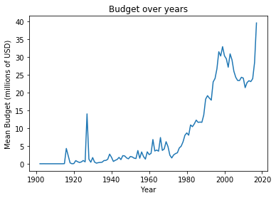
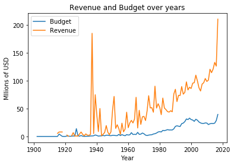
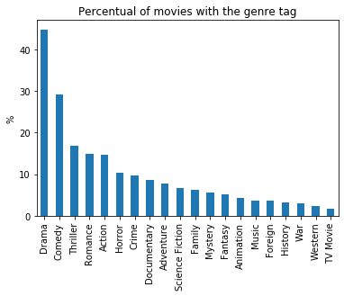
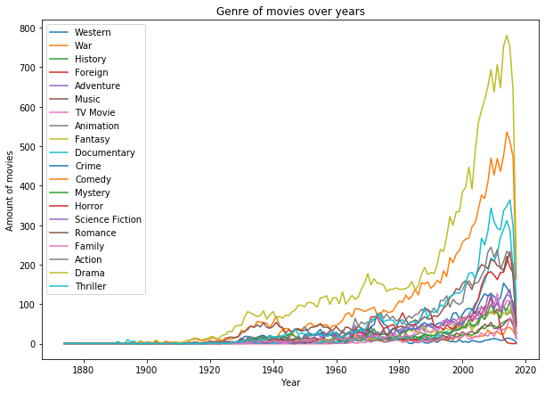

#  Data-Science Exercises on Python with Pandas 

Alexander Hagmann's course exercises on datascience in python with pandas.

https://www.udemy.com/course/python-data-science-with-pandas-master-advanced-projects/

### Table of Contents
1. [Project 1 - Explanatory Data Analysis & Data Presentation with Movies Dataset](#project-1---explanatory-data-analysis--data-presentation-with-movies-dataset)
2. [Dataset](#2-dataset)

## Project 1 - Explanatory Data Analysis & Data Presentation with Movies Dataset

### Budget

From the dataset, the average budget for each year was calculated. It can be seen a very sharp growth from the 1980s, with the peak in the 2000s. After that, there is a brief period of decline followed by a new boom.

The growing budget since the 1980s has led to increased revenues as well.

### Genre

Approximately 40% of the movies are classified as drama genre. The other most common film genres are Comedy and Thriller. This pattern has always been like this.

